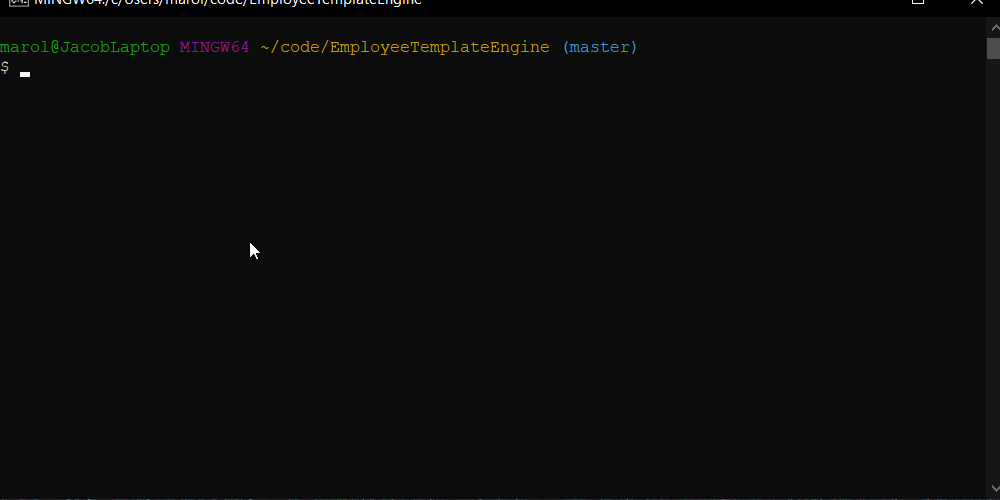

# Employee Template Engine

A software engineering team generator CLI application that prompts for employee info and generates an HTML page that displays this info on convenient cards.



## Table of Contents
1. [Installation Instructions](#installation-instructions)
2. [Usage](#usage)
3. [Tests](#tests)
4. [Status](#status)
5. [Questions](#questions)


## Installation Instructions
```
npm install
```

## Usage
```
node app.js
```
Then just follow the prompts. The resulting HTML page will be placed in the output folder.

## Tests
```
npm test
```

## Status


## Questions
If you have any questions, you can ask Mrjcowman at Mrjcowman@gmail.com or through GitHub at [their profile](https://github.com/Mrjcowman)
